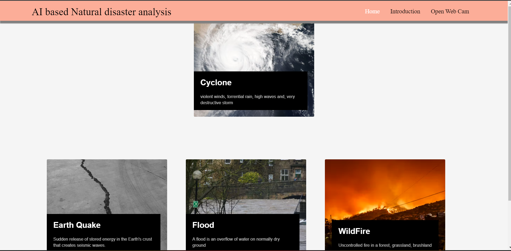
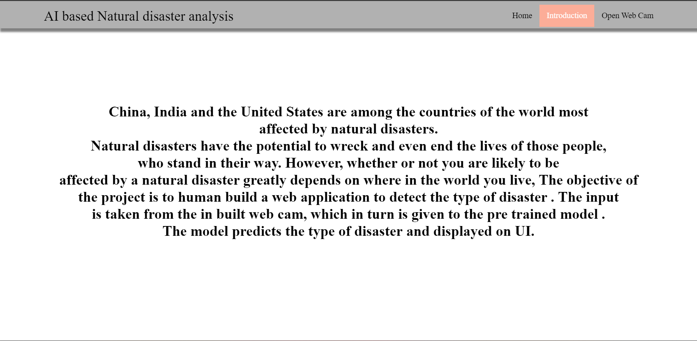
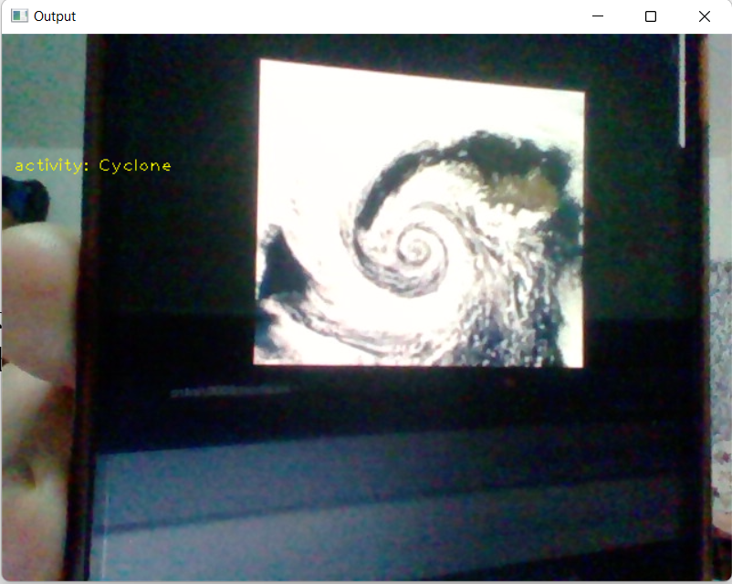
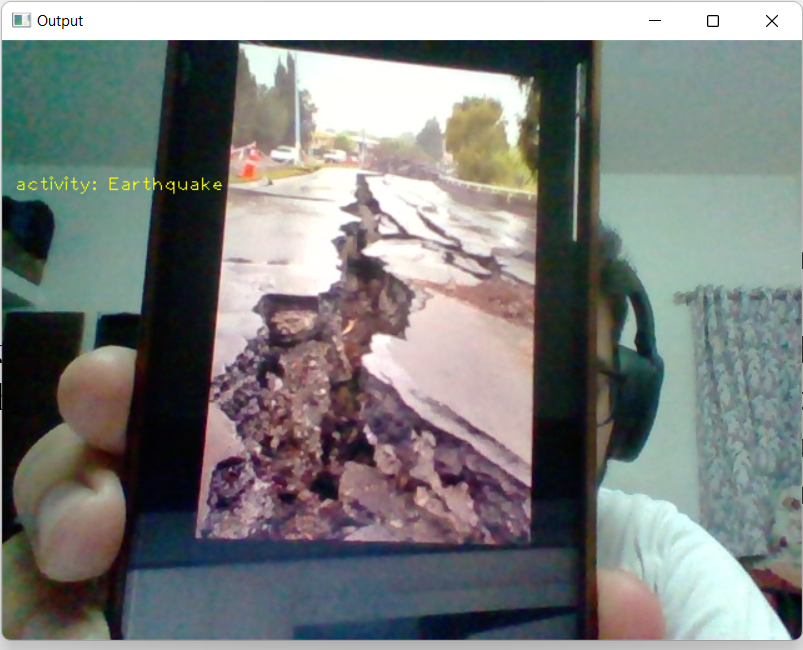

# Natural Disasters Intensity Analysis and Classification using Artificial Intelligence

Model trained using Tensorflow and web-app made using flask.

## Project screenshots

### Homepage

### Introduction page

### Video cam prediction results

### Cyclone

### Wildfire

### Earthquake

